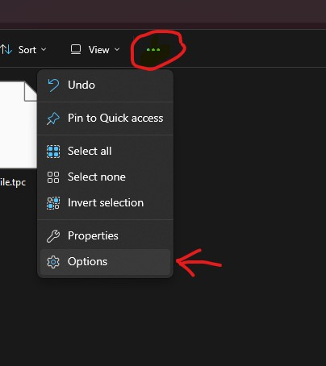
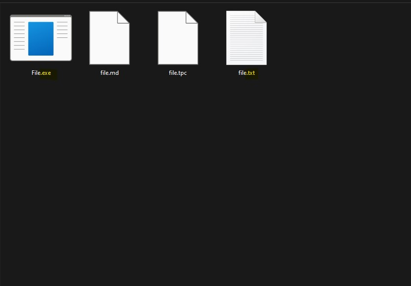

## Preamble

Showing the extensions for all filetypes is very simple, and can make installing 
and setting up software and mods much easier since it will prevent errors and confusion.

The image below shows a folder with four files that share a name. Without all file extensions you might
mistakenly edit or delete the wrong file.




## Method

### Windows 11

Open the folder that contains your files. Then open the options 




Explain what the tutorial will cover and what the reader will achieve by the end.

## Prerequisites Details

Expand on the prerequisites listed in the frontmatter. Explain exactly what knowledge is needed
and link to resources where readers can learn these prerequisites.

## Step 1: Getting Started

Break down the tutorial into clear, numbered steps. Each step should be focused on a single concept
or task.

### Code Example

```csharp
// Include relevant code examples
public class TutorialExample {
    void ExampleMethod() {
        // Add comments explaining the code
    }
}
```

## Step 2: Implementation

Include screenshots or diagrams where helpful:


## Common Issues

List potential problems readers might encounter and their solutions.

## Next Steps

Suggest what readers should learn next and link to related tutorials.
