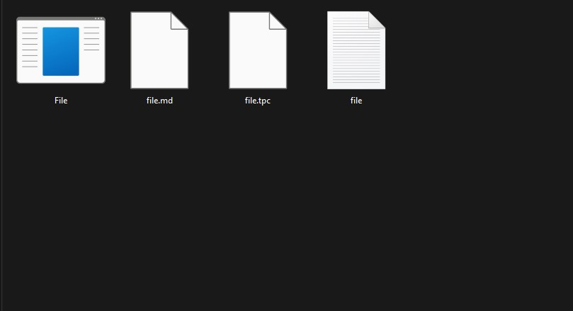
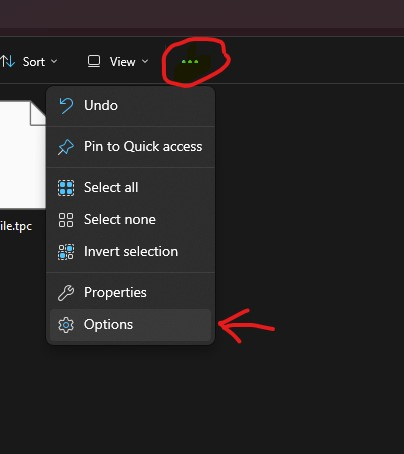
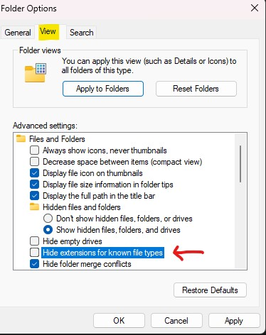

## Preamble

Showing the extensions for all filetypes is very simple, and can make installing 
and setting up software and mods much easier since it will prevent errors and confusion.

The image below shows a folder with four files that share a name. Without all file extensions you might
mistakenly edit or delete the wrong file.

## Method

### Windows 11

#### Step 1

Open the folder that contains your files. Then open the options 

#### Step 2

From the Folder Options, navigate to the view tab. Then under advanced settings uncheck "Hide extensions for known file types"

If you would like to apply this to all folders you can click on Apply to Folders. Otherwise, simply click apply and you are done.

### Results

If all went well you should now see the extensions for all file types. 

